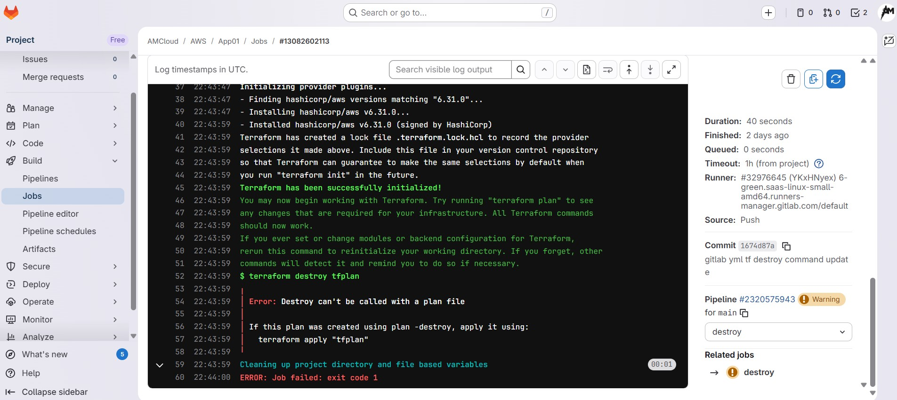

# Terraform Troubleshooting 09 -- Destroy can't be called with a plan file:-

Below follows the Platform information to better understand the Issue and Resolution.

| __Type__ |  __Name__ |
| :---------: | :---------: |
| CICD |  Gitlab |
| Cloud Provider |  AWS |

|  | 
| --------- |

